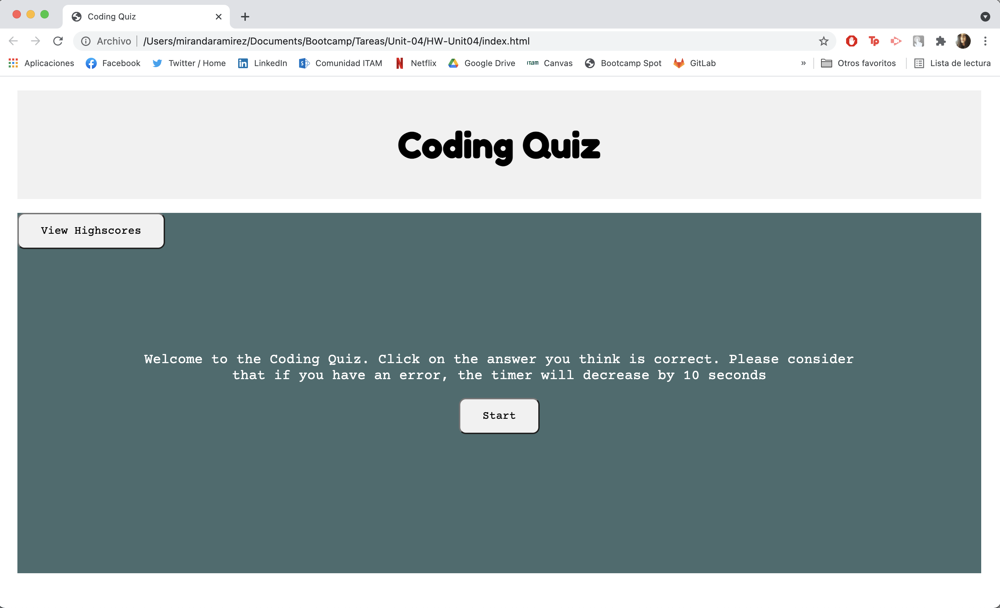

# 04 Web APIs: Code Quiz
# Miranda Ramírez Caballero 

## The Task

The task mainly consisted on building a timed coding quiz with multiple-choice questions. This app will run in the browser and will feature dynamically updated HTML and CSS powered by JavaScript code. It will have a clean, polished, and responsive user interface. 

## The solution 

For the solution many elements needed to be taken into account:
* Made a simple but elegant desing that is comfortable to the user
* Instructions are barely needed due to the self-explanatory use of the page 
* Each button, heading, paragraph and section displays as needed
* Every button has an adequate functionality 
* The quiz functions perfectly: adds points to the score when correct and decreases time when incorrect 
* The quiz stops both because of time or because questions have ended

## Deployed application: 

Deployed application in gitHub: https://mirandarmz.github.io/HW-Unit04/

* Screenshot:

## Conclusion

Overall, I found the assignment was challenging and integrated almost every element we have learned so far. I really enjoyed the challenge and to be able to utilise as much of my knowledge available and even deepen it.